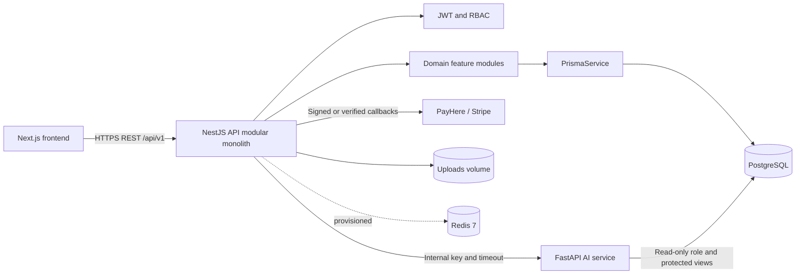
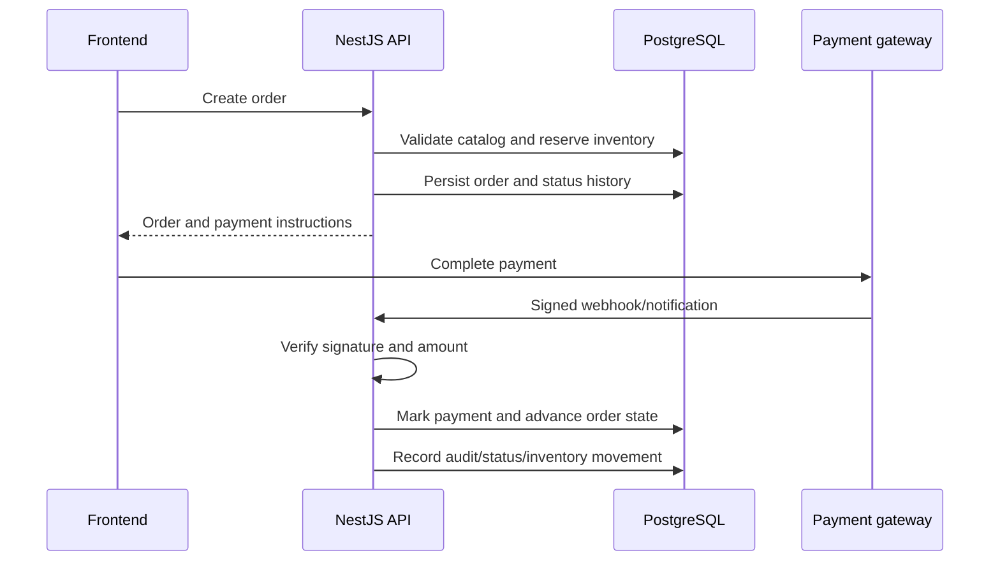

# Backend Technology and Architecture

**System:** Textile Automation Platform  
**Assessment date:** 2026-09-09  
**Scope:** Implemented backend code and the backend-facing AI service

## 1. Executive Summary

The platform uses a **modular monolith** for its primary business API and a
separate Python AI service for assistant and analytics workloads.

- The main API is a NestJS application written in TypeScript and executed on
  Node.js.
- PostgreSQL is the system of record. Prisma provides the generated,
  type-safe database client and migration workflow.
- The API exposes versioned REST endpoints under `/api/v1`.
- Authentication is JWT-based with database-backed refresh tokens. A global
  guard makes authentication deny-by-default, with explicit `@Public()`
  exceptions.
- Payments, inventory, production, notifications, reviews, uploads, and
  social publishing are isolated into NestJS feature modules.
- The AI service is a separate FastAPI process. NestJS acts as its trusted
  gateway, and the AI service uses a PostgreSQL read-only role plus protected
  views for business analytics.
- Docker Compose runs PostgreSQL, Redis, the NestJS API, the AI service, and
  the Next.js frontend together for local development.

The result is a practical modular-monolith architecture: features are
separated in code and can later be extracted, while transactions and core
business rules remain centralized in one API and one database.

## 2. Implemented Technology Stack

### 2.1 Main backend

| Area | Implemented technology | Evidence |
|---|---|---|
| Framework | NestJS 11 | `backend/package.json`, `backend/src/app.module.ts` |
| Language | TypeScript 5.7 | `backend/tsconfig.json` |
| Runtime | Node.js, ES2023 target | `backend/tsconfig.json`, `backend/Dockerfile` |
| HTTP server | Express through `@nestjs/platform-express` | `backend/src/main.ts` |
| API style | REST, versioned at `/api/v1` | `backend/src/main.ts` |
| ORM | Prisma 6 with generated `@prisma/client` | `backend/prisma/schema.prisma` |
| Database | PostgreSQL 16 in local Compose | `backend/prisma/schema.prisma`, `docker-compose.yml` |
| Authentication | Passport JWT, `@nestjs/jwt`, HTTP-only cookie support | `backend/src/auth`, `backend/src/main.ts` |
| Password hashing | bcrypt | `backend/package.json`, `backend/prisma/seed.ts` |
| Validation | `class-validator`, `class-transformer`, global `ValidationPipe` | `backend/src/main.ts` |
| API documentation | Swagger/OpenAPI | `backend/src/main.ts` |
| Security headers | Helmet | `backend/src/main.ts` |
| Rate limiting | `@nestjs/throttler` | `backend/src/app.module.ts` |
| Testing | Jest, Supertest, Nest testing utilities | `backend/package.json`, `backend/test` |
| Formatting/linting | Prettier and ESLint | `backend/package.json`, `backend/eslint.config.mjs` |

### 2.2 AI and analytics service

| Area | Implemented technology | Evidence |
|---|---|---|
| Framework | FastAPI | `ai/app/main.py` |
| Language/runtime | Python 3.12 | `ai/Dockerfile` |
| ASGI server | Uvicorn | `ai/requirements.txt`, `ai/Dockerfile` |
| Validation/configuration | Pydantic and pydantic-settings | `ai/requirements.txt` |
| Database access | asyncpg connection pool | `ai/app/main.py` |
| Forecasting | pandas and statsmodels | `ai/requirements.txt`, `ai/app/analytics.py` |
| LLM integration | Provider abstraction configured in `ai/app/llm.py` | `ai/app/llm.py` |
| AI protection | Internal shared key, admin role forwarding, read-only DB role | `ai/app/main.py`, Prisma AI migrations |

### 2.3 Supporting infrastructure

- PostgreSQL data is persisted in the `postgres_data` Docker volume.
- Redis 7 is provisioned and health-checked in Docker Compose. The inspected
  backend does not currently show an active Redis client, cache, or queue
  module, so Redis should be treated as prepared infrastructure rather than an
  active backend dependency.
- Uploaded product images are stored in the `backend_uploads` named volume and
  served by the API at `/uploads/<file>`.
- The backend container runs database migrations before starting the compiled
  application and runs as the non-root `node` user.
- The AI container runs as a non-root `aiuser` user.

## 3. High-Level Architecture



The main backend is not split into network microservices. NestJS modules are
the internal architectural boundaries, while the AI service is the one
deliberately separate runtime because Python analytics and potentially slow
LLM calls should not occupy the checkout API process.

## 4. NestJS Backend Structure

`AppModule` registers the global configuration, throttling, Prisma, and all
business feature modules. The feature folders follow a conventional NestJS
controller-service-module structure, usually with DTOs and local helpers.

| Module | Responsibility |
|---|---|
| `auth` | Registration, login, JWT access tokens, refresh-token rotation/revocation, password handling, and user identity |
| `verification` | Email/SMS verification codes and verification workflows |
| `products` | Product catalog, categories, product attributes, search, and catalog administration |
| `orders` | Cart/checkout order creation, order status transitions, and order history |
| `payments` | PayHere, Stripe-compatible paths, COD, installments, signed webhooks, and admin payment actions |
| `inventory` | Available/reserved quantities, stock movements, low-stock behavior, and reconciliation |
| `production` | Worker records, production tasks, stage progression, assignment, and quality checks |
| `analytics` | Business aggregates and proxy access to predictive AI endpoints |
| `ai` | Customer assistant, admin business assistant, AI gateway authentication, timeout, and fallback behavior |
| `notifications` | Notification records and dispatch coordination |
| `email` | Transactional email provider integration and email rendering |
| `sms` | SMS provider integration for verification and notifications |
| `uploads` | Product image upload and static-file serving support |
| `invoices` | Invoice generation and document output |
| `reviews` | Reviews, helpful votes, reports, moderation, and product feedback |
| `social` | Social caption generation and Facebook/Instagram/WhatsApp publishing/logging |
| `prisma` | Global `PrismaService` lifecycle and database access |
| `common` | Guards, decorators, DTO conventions, filters, interceptors, configuration validation, and shared request types |

### Internal layering

The normal request path is:

```text
HTTP request
  -> Nest controller and DTO transformation
  -> global throttling and JWT guard
  -> route-level role guard where required
  -> feature service
  -> PrismaService or an external provider adapter
  -> PostgreSQL / gateway / notification provider
  -> response interceptor envelope
```

Controllers are the transport boundary. Services own business decisions and
coordinate transactions. Prisma models and migrations own persistence shape
and database constraints. The code does not use a separate generic repository
layer; feature services commonly call Prisma directly.

## 5. Request Pipeline and API Contract

The bootstrap in `backend/src/main.ts` configures the following cross-cutting
behavior:

1. Helmet adds security headers. Content Security Policy is intentionally left
   to the frontend because the API serves JSON.
2. Cookie parsing supports HTTP-only refresh-token cookies.
3. The global prefix makes application routes available below `/api/v1`.
4. CORS permits the configured frontend and approved local/Vercel origins with
   credentials enabled.
5. `ValidationPipe` strips unknown fields, rejects non-whitelisted fields, and
   transforms DTO values.
6. `HttpExceptionFilter` returns a stable error envelope and hides details of
   unexpected internal exceptions from clients.
7. `TransformInterceptor` returns a stable success envelope:

   ```json
   {
     "success": true,
     "message": null,
     "data": {},
     "error": null,
     "timestamp": "2026-09-09T00:00:00.000Z"
   }
   ```

8. Swagger is available at `/api/v1/docs` unless `SWAGGER_ENABLED=false`.
9. Health is available at `/api/v1/health`; the container health check uses
   this endpoint.

## 6. Authentication and Authorization

Authentication is implemented as a deny-by-default policy:

- `JwtAuthGuard` is registered globally as an `APP_GUARD`.
- A route must explicitly use `@Public()` to allow anonymous access.
- `JwtStrategy` validates bearer access tokens and places the authenticated
  user on the request.
- `RolesGuard` and `@Roles(...)` enforce role-specific operations.
- Roles represented in the database are `ADMIN`, `MANAGER`, `CUSTOMER`, and
  `WORKER`.
- Refresh tokens are persisted as SHA-256 hashes, with expiry and revocation
  fields, rather than storing raw tokens.
- Passwords are stored as bcrypt hashes.
- Environment validation refuses unsafe or incomplete required configuration,
  including a missing/short JWT secret.

Public routes are intentional, not accidental. Examples include health/root
routes, selected catalog access, the customer AI chat, payment configuration,
and server-to-server payment callbacks. Public AI chat is additionally limited
to 10 requests per minute per IP.

## 7. Data Architecture

The Prisma datasource targets PostgreSQL and supports a separate `DIRECT_URL`
for migration DDL when the runtime URL is pooled, such as with Neon or
PgBouncer. Migrations are stored under `backend/prisma/migrations`.

The principal bounded data areas are:

- Identity: `User`, `RefreshToken`, `VerificationCode`, `AuditLog`.
- Catalog: `Category`, `Product`.
- Commerce: `Order`, `OrderItem`, `OrderStatusHistory`.
- Payments: `Payment`, `Installment`, `PaymentWebhookEvent`.
- Stock: `Inventory`, `InventoryMovement`.
- Manufacturing: `Worker`, `ProductionTask`, `CustomerMeasurement`.
- Communication: `Notification`.
- Marketing and feedback: `SocialPost`, `Review`, `ReviewHelpfulVote`, and
  `ReviewReport`.

The schema uses UUID identifiers, PostgreSQL enums for important state
machines, foreign-key relations, indexes for common lookups, and JSONB for
flexible fields such as addresses, product attributes, and gateway payloads.
Inventory and order/payment state changes are handled in service-level
transactions where multiple records must stay consistent.

## 8. Core Business Flows

### 8.1 Order, inventory, and payment



The payment controller deliberately does not expose a customer-facing
"self-confirm payment" endpoint. Completion is based on a verified gateway
callback or an audited admin action. The implementation supports PayHere
notifications, Stripe webhook handling, COD, full payment, and installments.

### 8.2 AI customer assistant

1. A public customer request enters `POST /api/v1/ai/customer-chat`.
2. NestJS applies the stricter throttle and sends the request to FastAPI with
   `X-Internal-Key`.
3. The AI service searches permitted catalog data and may use the configured
   LLM provider.
4. If the AI service is unavailable or times out, NestJS falls back to normal
   product search so catalog browsing and checkout remain available.

### 8.3 AI business assistant and analytics

1. An authenticated NestJS admin calls the business assistant or analytics
   proxy route.
2. NestJS verifies the JWT and `ADMIN` role before forwarding the request.
3. FastAPI requires both the internal key and forwarded admin role.
4. The AI database user can read only approved catalog/inventory tables and
   PII-reduced analytics views. It cannot write or directly read sensitive base
   tables such as users, payments, or addresses.
5. Business analytics uses a fixed tool allow-list and parameterized queries;
   the model does not generate arbitrary SQL.

## 9. Deployment and Operations

### Local Compose topology

| Container | Port | Purpose |
|---|---:|---|
| `postgres` | 5433 on host / 5432 in network | PostgreSQL 16 data store |
| `redis` | 6379 | Provisioned cache/queue infrastructure |
| `backend` | 3001 | NestJS API and static uploads |
| `ai` | 8000 | FastAPI assistant and analytics |
| `frontend` | 3000 | Next.js web application |

The backend waits for healthy PostgreSQL and Redis containers, but it does not
declare a startup dependency on the AI container. This is intentional: the
shop API can start without AI and customer chat can degrade to catalog search.

The production-style backend image compiles NestJS, copies Prisma artifacts,
runs `prisma migrate deploy`, and starts `dist/main.js`. Secrets are supplied
through environment variables; `.env` files must not be committed.

### Important environment groups

- Database: `DATABASE_URL`, `DIRECT_URL`.
- API/auth: `PORT`, `FRONTEND_URL`, `JWT_SECRET`, `JWT_EXPIRATION`.
- AI gateway: `AI_SERVICE_URL`, `INTERNAL_API_KEY`, `AI_TIMEOUT_MS`.
- Payment: PayHere settings, Stripe settings, and webhook secrets.
- Messaging: Resend/email and SMS provider settings.
- Social publishing: Meta page/account/token settings.
- Operational controls: `SWAGGER_ENABLED`, `THROTTLE_LIMIT`, and development
  OTP bypass settings.

## 10. Testing and Quality

The backend provides unit tests under `backend/src` and end-to-end tests under
`backend/test`. The available commands are:

```powershell
cd backend
npm install
npm run build
npm run lint
npm run test
npm run test:e2e
npm run db:status
```

The AI service has pytest-based tests under `ai/tests` and can be run with:

```powershell
cd ai
pytest
```

The most valuable regression areas are payment signature validation, inventory
reservation/release invariants, order status transitions, role isolation,
refresh-token revocation, AI fallback behavior, and read-only AI database
permissions.

## 11. Architecture Strengths and Risks

### Strengths

- Clear feature module boundaries without premature distributed-service
  complexity.
- Global authentication fails closed for newly added routes.
- DTO validation, rate limiting, Helmet, CORS, and stable error envelopes are
  centralized.
- Payment completion is based on independently verified evidence.
- Prisma migrations and PostgreSQL constraints provide a durable data model.
- The AI service is isolated from the checkout process and structurally limited
  by a database role and views.
- Container images use non-root users and health checks.

### Risks or follow-up items

- Redis is available in Compose but is not visibly wired into the current NestJS
  application. Add an explicit cache/queue design before relying on it for
  sessions, jobs, or distributed throttling.
- The local Compose file contains development credentials and a development OTP
  bypass. Production deployment must override these and disable bypasses.
- CORS currently allows every `*.vercel.app` origin. This is convenient for
  previews but should be narrowed for a production tenant/domain.
- The API and AI service share a database server, so connection limits and
  read-only role permissions should remain part of deployment checks.
- The generic scaffold `backend/README.md` does not describe the actual
  textile backend. Replacing it with project-specific setup and operational
  notes would reduce onboarding friction.

## 12. GitHub Branch, Commit, and Push Workflow

The following commands are for the developer to run from the repository root.
They are intentionally not executed as part of this report.

### First-time checks

```powershell
git status
git remote -v
git branch --show-current
```

### Create a new branch

Use a short descriptive name. For example:

```powershell
git switch -c docs/backend-architecture
```

### Review and stage only the intended files

```powershell
git status
git diff -- BACKEND_TECHNOLOGY_AND_ARCHITECTURE.md
git add BACKEND_TECHNOLOGY_AND_ARCHITECTURE.md
git diff --cached --check
git diff --cached
```

`git diff --cached --check` catches whitespace errors. Reviewing the staged
diff confirms that no `.env`, credentials, build output, or unrelated files
are included.

### Commit the change

```powershell
git commit -m "docs: document backend technology and architecture"
```

### Push the new branch to GitHub

```powershell
git push -u origin docs/backend-architecture
```

The `-u` option records the upstream branch, so later pushes can usually be
made with only `git push`. After the push, open the repository on GitHub and
create a pull request from `docs/backend-architecture` into the project's
default branch. Before merging, review CI results and confirm that only the
intended documentation change is included.

## 13. Evidence Index

- Main bootstrap and cross-cutting pipeline: `backend/src/main.ts`
- Root module composition: `backend/src/app.module.ts`
- Backend dependencies and scripts: `backend/package.json`
- Database schema and relations: `backend/prisma/schema.prisma`
- Database migrations: `backend/prisma/migrations/`
- JWT and role guards: `backend/src/common/guards/`, `backend/src/auth/`
- AI gateway: `backend/src/ai/`
- AI runtime: `ai/app/main.py`, `ai/app/analytics.py`, `ai/app/business.py`
- Container topology: `docker-compose.yml`
- Backend image startup: `backend/Dockerfile`
- AI database isolation: `backend/prisma/migrations/20260712010000_ai_readonly_role/`
  and `backend/prisma/migrations/20260712020000_ai_analytics_views/`