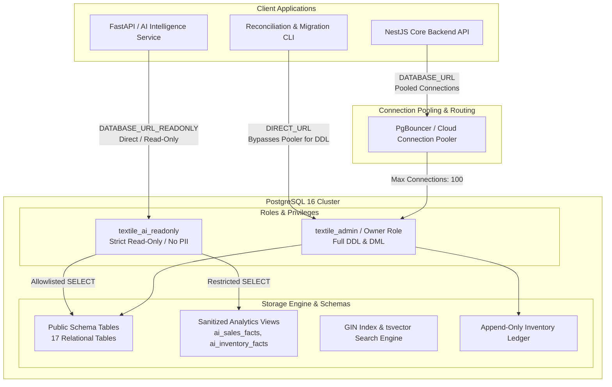
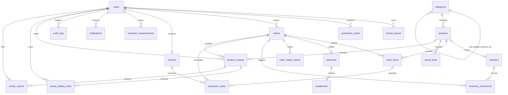
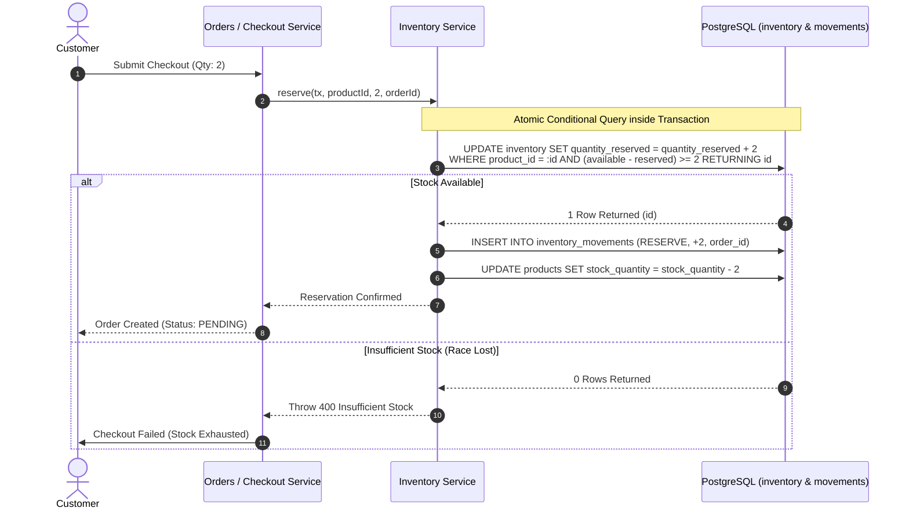

# Smart Textile Business Management & E-Commerce Platform
## Database Architecture Specification (PostgreSQL 16)

> **Document Type:** Production Database Architecture & Technical Reference  
> **Target Audience:** Principal Database Engineers, Backend Architects, DevOps & SRE Teams  
> **Status:** Authoritative / Production Grade  
> **RDBMS Engine:** PostgreSQL 16.x (Alpine)  
> **Data Access Layer:** Prisma ORM 6.x + Native PostgreSQL Stored Procedures, Views, GIN Full-Text Indices, & Check Constraints  

---

## 1. Executive Summary & Design Philosophy

The database architecture powering the **Smart Textile Business Management & E-Commerce Platform** is engineered to bridge two disparate operational demands within a single, coherent data platform:
1. **High-Concurrency B2C E-Commerce:** Flash sales, multi-channel checkout, cart reservations, payment webhook idempotency, and full-text garment catalog search.
2. **Shop-Floor ERP & Manufacturing Pipeline:** Multi-stage bespoke textile manufacturing (Cutting $\rightarrow$ Stitching $\rightarrow$ Finishing $\rightarrow$ Quality Control), worker shift tracking, customer physical measurement profiling, and strict financial inventory ledger auditing.

### Key Architectural Tenets
* **Mathematical Invariance Over Application Logic:** Critical business constraints (such as preventing negative inventory or preventing over-reservation) are enforced by PostgreSQL itself through database-level `CHECK` constraints and `RESTRICT` foreign keys, ensuring that even rogue queries or unhandled application races cannot violate data integrity.
* **Double-Entry Append-Only Inventory Ledger:** Inventory balances (`quantity_available`, `quantity_reserved`) are denormalized projections backed by an immutable ledger of signed `inventory_movements`. Every single physical movement traces to an order or an authenticated administrator.
* **Hybrid Relational + JSONB Paradigm:** Strictly normalized 3NF relational models handle transactions, financial reconciliation, and stage workflows, while PostgreSQL's binary JSON (`JSONB`) engine provides high flexibility for garment measurement schemas, size-variant inventory matrices (`sizeStock`), and third-party webhook payloads.
* **Zero-Trust AI & Security Boundaries:** The AI Shopping Assistant and Business Intelligence services connect to PostgreSQL through an isolated, read-only database role (`textile_ai_readonly`) restricted exclusively to whitelisted tables and sanitized database views (`ai_sales_facts`, `ai_inventory_facts`) where all Customer Personally Identifiable Information (PII) is structurally excised at the query engine level.

---

## 2. Infrastructure & Connection Topology



### Connection Pool Configuration
* **`DATABASE_URL` (Pooled Access):** Configured with connection pooling parameters for typical transaction-level pooling in PgBouncer / Neon. Used for standard application queries with low connection establishment latency.
* **`DIRECT_URL` (Direct Connection):** Connects directly to the PostgreSQL TCP socket (port `5432` / host mapping `5433`), bypassing transaction-level poolers. Essential for running Prisma migrations (`prisma migrate deploy`) and table locking operations without pooler deadlocks.
* **Transaction Isolation Level:** **Read Committed** (PostgreSQL default) enhanced with atomic conditional queries (`UPDATE ... RETURNING`) and explicit row-level locks where strict isolation is mandatory.

---

## 3. High-Level Entity Relationship Diagram (ERD)



---

## 4. Comprehensive Schema Dictionary & Domain Specifications

### 4.1. Identity, Authentication & Access Control

#### Table: `users`
The root identity store for all system actors (Customers, Tailors/Workers, Store Managers, and Super Administrators).
```sql
CREATE TABLE users (
    id UUID PRIMARY KEY DEFAULT gen_random_uuid(),
    email TEXT UNIQUE,
    phone TEXT UNIQUE,
    password_hash TEXT NOT NULL,
    first_name TEXT NOT NULL,
    last_name TEXT NOT NULL,
    email_verified BOOLEAN DEFAULT false,
    phone_verified BOOLEAN DEFAULT false,
    role "UserRole" NOT NULL DEFAULT 'CUSTOMER',
    is_active BOOLEAN NOT NULL DEFAULT true,
    created_at TIMESTAMP(3) NOT NULL DEFAULT CURRENT_TIMESTAMP,
    updated_at TIMESTAMP(3) NOT NULL
);
```
* **Dual Identity Architecture:** Either `email` or `phone` can be null, but at least one is mandatory. PostgreSQL permits multiple `NULL` values in columns with `UNIQUE` constraints, allowing email-only and phone-only accounts to coexist seamlessly without dummy values.
* **Role Enumeration (`UserRole`):** `ADMIN`, `MANAGER`, `CUSTOMER`, `WORKER`.

#### Table: `refresh_tokens`
Long-lived cryptographic session tokens.
* **`token_hash`:** Stored strictly as a SHA-256 hex digest. A raw database dump exposes no usable refresh tokens.
* **Revocation Policy:** `revoked_at` timestamp allows instant single-device logout or global session revocation.

#### Table: `verification_codes`
Time-based, short-lived 6-digit verification codes for multi-channel identity verification (Email / SMS).
* **Cryptographic Storage:** Only the SHA-256 hash of the 6-digit code is stored (`code_hash`). Plaintext exists solely in the sent transmission.
* **Brute-Force Guard:** Governed by `attempts` counter (capped in application logic), strict expiry (`expires_at`), and an index on `(user_id, channel, created_at)`.

---

### 4.2. Catalog, Merchandising & Full-Text Search Engine

#### Table: `categories`
Hierarchical taxonomy tree for textile goods.
* **Self-Referential Tree:** `parent_category_id UUID REFERENCES categories(id) ON DELETE RESTRICT`.
* **Structural Guarantee:** Maximum category nesting depth is capped at 2 levels. `ON DELETE RESTRICT` guarantees at the database engine level that no category with active children can be deleted.

#### Table: `products`
The core merchandising catalog.
```sql
CREATE TABLE products (
    id UUID PRIMARY KEY DEFAULT gen_random_uuid(),
    name TEXT NOT NULL,
    slug TEXT NOT NULL UNIQUE,
    sku TEXT NOT NULL UNIQUE,
    description TEXT,
    price DECIMAL(10,2) NOT NULL,
    compare_at_price DECIMAL(10,2),
    cost_price DECIMAL(10,2),
    stock_quantity INTEGER NOT NULL DEFAULT 0,
    product_type "ProductType" NOT NULL DEFAULT 'READY_MADE',
    requires_measurement BOOLEAN NOT NULL DEFAULT false,
    fabric_type TEXT,
    color TEXT,
    unit TEXT,
    images JSONB NOT NULL DEFAULT '[]',
    attributes JSONB NOT NULL DEFAULT '{}',
    category_id UUID REFERENCES categories(id) ON DELETE RESTRICT,
    sub_category TEXT,
    is_active BOOLEAN NOT NULL DEFAULT true,
    search_vector tsvector GENERATED ALWAYS AS (
        setweight(to_tsvector('english', coalesce(name, '')), 'A') ||
        setweight(to_tsvector('english', coalesce(fabric_type, '')), 'B') ||
        setweight(to_tsvector('english', coalesce(color, '')), 'B') ||
        setweight(to_tsvector('english', coalesce(description, '')), 'C')
    ) STORED,
    created_at TIMESTAMP(3) NOT NULL DEFAULT CURRENT_TIMESTAMP,
    updated_at TIMESTAMP(3) NOT NULL
);
```

#### Full-Text Search (FTS) Design:
* **Generated Column:** `search_vector` is computed and stored natively by PostgreSQL on every `INSERT` or `UPDATE`. Application logic cannot forget to re-index products.
* **Relevance Weighting:**
  * **Weight A (Highest):** Product Title (`name`)
  * **Weight B (Medium):** Textile specifications (`fabric_type`, `color`)
  * **Weight C (General):** Long-form `description`
* **Indexing:** Indexed via a native PostgreSQL GIN index (`CREATE INDEX products_search_vector_idx ON products USING GIN (search_vector)`), executing linguistic lexeme queries in $< 2\text{ms}$.
* **Per-Size Inventory Matrix (`attributes.sizeStock`):** For products with variants (e.g. S, M, L, XL), `attributes` stores a JSONB map of available units per size.

---

### 4.3. Authoritative Double-Entry Inventory Ledger

The inventory architecture enforces an uncompromised single source of truth across all sales and restocking channels.



#### Table: `inventory`
Denormalized, high-speed authoritative stock register.
```sql
CREATE TABLE inventory (
    id UUID PRIMARY KEY DEFAULT gen_random_uuid(),
    product_id UUID NOT NULL UNIQUE REFERENCES products(id) ON DELETE CASCADE,
    quantity_available INTEGER NOT NULL DEFAULT 0,
    quantity_reserved INTEGER NOT NULL DEFAULT 0,
    minimum_stock_level INTEGER NOT NULL DEFAULT 0,
    low_stock_notified BOOLEAN NOT NULL DEFAULT false,
    created_at TIMESTAMP(3) NOT NULL DEFAULT CURRENT_TIMESTAMP,
    updated_at TIMESTAMP(3) NOT NULL,
    CONSTRAINT inventory_non_negative CHECK (
        quantity_available >= 0 AND
        quantity_reserved >= 0 AND
        quantity_reserved <= quantity_available
    )
);
```

#### Table: `inventory_movements`
The immutable, append-only financial and physical ledger.
```sql
CREATE TABLE inventory_movements (
    id UUID PRIMARY KEY DEFAULT gen_random_uuid(),
    inventory_id UUID NOT NULL REFERENCES inventory(id) ON DELETE CASCADE,
    type "MovementType" NOT NULL,
    quantity_change INTEGER NOT NULL,
    note TEXT,
    order_id UUID REFERENCES orders(id) ON DELETE RESTRICT,
    user_id UUID,
    created_at TIMESTAMP(3) NOT NULL DEFAULT CURRENT_TIMESTAMP
);
```

#### Movement Types & Sign Conventions:
| `MovementType` | Sign of `quantity_change` | Operational Trigger | Effect on `inventory` |
| :--- | :---: | :--- | :--- |
| `INITIAL` | `+` | First creation of SKU inventory row | `available += qty` |
| `RESERVE` | `+` | Checkout placement | `reserved += qty` |
| `RELEASE` | `-` | Order cancellation / Payment failure | `reserved -= qty` |
| `SALE` | `-` | Payment confirmed / COD verified | `available -= qty, reserved -= qty` |
| `PURCHASE` | `+` | Factory restock / Supplier delivery | `available += qty` |
| `ADJUSTMENT`| `+/-` | Physical inventory count discrepancy | `available +/-= qty` |
| `DAMAGE` | `-` | Scrap, defect, or fabric damage write-off | `available -= qty` |

#### Architectural Protections:
1. **Database Check Constraint (`inventory_non_negative`):** Declares that `quantity_available` and `quantity_reserved` can never drop below zero, and `quantity_reserved` can never exceed `quantity_available`. Any bug in application code attempting to oversell produces a hard SQL abort.
2. **`ON DELETE RESTRICT` on `order_id`:** Orders that have triggered stock movements can never be deleted from the database. Financial history remains tamper-proof.
3. **Continuous Reconciliation Invariant:**
$$\text{quantity\_available} = \sum (\text{INITIAL} + \text{PURCHASE} + \text{ADJUSTMENT} - \text{DAMAGE} - \text{SALE})$$
$$\text{quantity\_reserved} = \sum (\text{RESERVE} - \text{RELEASE} - \text{SALE})$$
Audited in CI and background maintenance via `backend/scripts/reconcile-inventory.ts`.

---

### 4.4. Orders, Measurements & Custom Garments

#### Table: `orders`
The financial contract for goods and custom services.
* **Human-Readable Order Number:** Unique identifier formatted as `ORD-YYYYMMDD-XXXX`.
* **Financial Columns:** `subtotal`, `tax`, `shipping_cost`, `total` defined as `DECIMAL(10,2)` to guarantee exact accounting free of floating-point rounding errors.
* **Order Status Pipeline (`OrderStatus`):**
  $$\text{PENDING} \longrightarrow \text{CONFIRMED} \longrightarrow \text{IN\_PRODUCTION} \longrightarrow \text{QUALITY\_CHECK} \longrightarrow \text{COMPLETED} \longrightarrow \text{DELIVERED}$$
  $$\text{(or CANCELLED at eligible early stages)}$$

#### Table: `order_items`
Line items associated with an order.
* **`measurements` (JSONB Snapshot):** When a customer orders a custom garment (e.g. bespoke suit or school uniform), their exact physical measurements are copied into this JSONB column at the moment of checkout. Subsequent updates to the customer's personal measurement profile never rewrite historic manufacturing specs.

#### Table: `customer_measurements`
Reusable customer measurement profiles (e.g., "Father's Blazer", "Son's School Uniform") supporting flexible key-value anatomical metrics (chest, waist, collar, sleeve, inseam).

#### Table: `order_status_history`
Append-only chronological audit log of state transitions (`from_status` $\rightarrow$ `to_status`), capturing timestamps, notes, and the executing user ID.

---

### 4.5. Multi-Channel Billing, Installments & Webhook Idempotency

#### Table: `payments`
Unified billing record supporting Stripe (International Credit Cards), PayHere (Sri Lankan Local Gateway), Cash on Delivery (COD), and Custom Installments.

#### Table: `installments`
Payment milestone schedules for high-value bespoke apparel. Each record tracks `installment_no`, `amount`, `due_date`, and individual settlement status.

#### Table: `payment_webhook_events`
```sql
CREATE TABLE payment_webhook_events (
    id UUID PRIMARY KEY DEFAULT gen_random_uuid(),
    gateway TEXT NOT NULL,
    transaction_id TEXT,
    event_status TEXT NOT NULL,
    payload JSONB NOT NULL,
    signature TEXT,
    signature_valid BOOLEAN NOT NULL DEFAULT false,
    processed BOOLEAN NOT NULL DEFAULT false,
    processing_error TEXT,
    created_at TIMESTAMP(3) NOT NULL DEFAULT CURRENT_TIMESTAMP,
    CONSTRAINT payment_webhook_events_unique_event 
        UNIQUE (gateway, transaction_id, event_status)
);
```
* **Idempotency Guarantee:** Gateways (Stripe, PayHere) routinely retry webhooks. The composite unique constraint `(gateway, transaction_id, event_status)` guarantees that duplicate HTTP POST deliveries are instantly caught and de-duplicated by the database engine without double-crediting orders.

---

### 4.6. Shop-Floor Manufacturing & Worker Pipeline

#### Table: `workers`
Production personnel master table. Maps 1:1 with `users` (`role = WORKER`).
* **Attributes:** `specialization` (`ProductionStage`), `skill_level` ($1-5$), `hourly_rate` (`DECIMAL(10,2)`), `is_active`.

#### Table: `production_tasks`
Discrete shop-floor tasks spawned when an order contains items requiring production (`ProductType` $\in \{\text{UNIFORM}, \text{CUSTOM}\}$ or `requires_measurement = true`).
* **Stage Progression (`ProductionStage`):**
  $$\text{CUTTING} \longrightarrow \text{STITCHING} \longrightarrow \text{FINISHING} \longrightarrow \text{QUALITY\_CHECK}$$
* **QC Rejection Loop:** If a task fails in `QUALITY_CHECK`, the system resets its stage to `FINISHING` with status `PENDING` and mandates an explanatory rejection note in `note`.
* **Worker Queue Optimization Index:** `CREATE INDEX production_tasks_assigned_worker_id_status_idx ON production_tasks(assigned_worker_id, status)` allows workers to fetch active tickets with sub-millisecond query time.

---

### 4.7. Customer Social Proof & Verified Reviews

#### Table: `product_reviews`
* **Verified Purchase Constraint:** Enforces one review per order, product, and customer:
  ```sql
  CONSTRAINT product_reviews_order_product_user_key UNIQUE (order_id, product_id, user_id)
  ```
* **Multi-Dimensional Metrics:** Records overall rating ($1-5$), plus textile-specific criteria: `fabric_rating` ($1-5$), `color_accuracy_rating` ($1-5$), `comfort_rating` ($1-5$), and `size_feedback` (`RUNS_SMALL`, `TRUE_TO_SIZE`, `RUNS_LARGE`).
* **Photo Reviews:** Indexed boolean flag `has_images` eliminates expensive JSON array scanning when shoppers filter for reviews with customer photos.

---

## 5. Security & Isolation Architecture

### 5.1. Database User Roles & Principle of Least Privilege

```mermaid
graph LR
    subgraph Master Database: textile_db
        subgraph Superuser / Migration
            postgres[postgres / textile_admin]
        end

        subgraph Application Connection
            app[textile_admin / App User]
        end

        subgraph AI Agent Connection
            ai[textile_ai_readonly]
        end

        subgraph Sensitive Tables
            T_Users[users<br/>password_hash, email, phone]
            T_Orders[orders<br/>shipping_address, billing_address]
            T_Payments[payments / installments<br/>card tokens, transaction IDs]
            T_Measure[customer_measurements<br/>body measurements]
        end

        subgraph Public Non-PII Tables
            T_Catalog[products, categories, inventory]
        end

        subgraph Sanitized Database Views
            V_Sales[ai_sales_facts<br/>anonymized revenue & volumes]
            V_Inventory[ai_inventory_facts<br/>stock levels & restock alerts]
        end
    end

    app -->|Full Access| Sensitive Tables
    app -->|Full Access| Public Non-PII Tables

    ai -.->|FORBIDDEN / REVOKED| Sensitive Tables
    ai -->|SELECT ONLY| Public Non-PII Tables
    ai -->|SELECT ONLY| Sanitized Database Views
```

#### The `textile_ai_readonly` Role:
1. Created with explicit read-only credentials:
   ```sql
   REVOKE INSERT, UPDATE, DELETE, TRUNCATE ON ALL TABLES IN SCHEMA public FROM textile_ai_readonly;
   GRANT SELECT ON TABLE products, categories, inventory TO textile_ai_readonly;
   ```
2. **Hard Block on Sensitive Data:** The AI service is physically prevented by PostgreSQL access control lists from querying `users`, `orders`, `payments`, `order_items`, or `customer_measurements`.

---

### 5.2. Sanitized Analytics Views

To empower the Business Intelligence AI Assistant to answer queries like *"What were our top 5 best sellers this month?"* or *"Which fabrics have high margins?"*, the platform provides views that strip all customer identity and address data before it can leave the database engine.

#### 1. `ai_sales_facts` View:
```sql
CREATE OR REPLACE VIEW ai_sales_facts AS
SELECT o.id                                   AS order_id,
       o.order_number,
       o.status::text                         AS order_status,
       o.created_at                           AS ordered_at,
       pay.status::text                       AS payment_status,
       COALESCE(pay.paid_at, pay.created_at)  AS paid_at,
       oi.product_id,
       pr.name                                AS product_name,
       pr.product_type::text                  AS product_type,
       oi.quantity,
       oi.unit_price,
       oi.total_price                         AS line_revenue,
       pr.cost_price,
       (oi.quantity * pr.cost_price)          AS line_cost
  FROM orders o
  JOIN order_items oi ON oi.order_id = o.id
  JOIN products pr    ON pr.id = oi.product_id
  LEFT JOIN payments pay ON pay.order_id = o.id;
```
* **PII Redaction:** Contains **zero** references to `user_id`, customer names, contact phone numbers, delivery addresses, or private checkout notes.

#### 2. `ai_inventory_facts` View:
```sql
CREATE OR REPLACE VIEW ai_inventory_facts AS
SELECT p.id                                           AS product_id,
       p.name                                         AS product_name,
       p.product_type::text                           AS product_type,
       p.price,
       i.quantity_available,
       i.quantity_reserved,
       (i.quantity_available - i.quantity_reserved)   AS sellable,
       i.minimum_stock_level,
       (i.quantity_available <= i.minimum_stock_level) AS is_low
  FROM products p
  JOIN inventory i ON i.product_id = p.id
 WHERE p.is_active;
```

---

## 6. Indexing & Query Optimization Strategy

### 6.1. Index Categorization Matrix

| Table | Index Columns | Type | Purpose |
| :--- | :--- | :---: | :--- |
| `products` | `(search_vector)` | **GIN** | Sub-millisecond catalog full-text search |
| `products` | `(slug)` | B-Tree Unique | Storefront product page resolution |
| `products` | `(category_id)` | B-Tree | Filtering products by category hierarchy |
| `products` | `(is_active, price)` | B-Tree Composite | Catalog catalog price-range filtering |
| `inventory_movements`| `(inventory_id, created_at)` | B-Tree Composite | Rapid SKU stock history & reconciliation replay |
| `inventory_movements`| `(order_id)` | B-Tree | Order cancellation & refund audit tracing |
| `orders` | `(user_id, created_at)` | B-Tree Composite | Customer purchase history pagination |
| `orders` | `(status)` | B-Tree | Admin order processing queues |
| `production_tasks` | `(assigned_worker_id, status)`| B-Tree Composite | Worker portal active task dashboard |
| `production_tasks` | `(stage, status)` | B-Tree Composite | Factory floor Kanban board columns |
| `notifications` | `(user_id, read_at)` | B-Tree Composite | Ultra-fast unread notification badge counts |
| `audit_logs` | `(entity_type, entity_id)` | B-Tree Composite | Entity change history tracing |
| `product_reviews` | `(product_id, status)` | B-Tree Composite | Published reviews retrieval per product |

---

## 7. High-Concurrency Transaction Patterns

### 7.1. Overselling Prevention Under Extreme Concurrency
Traditional approaches using `SELECT ... FOR UPDATE` often suffer from connection pool exhaustion and deadlocks during flash sales. This architecture uses **Atomic Conditional Updates**:

```sql
UPDATE inventory
   SET quantity_reserved = quantity_reserved + :requested_qty,
       updated_at = NOW()
 WHERE product_id = :product_id
   AND (quantity_available - quantity_reserved) >= :requested_qty
RETURNING id;
```
* **Mechanism:** PostgreSQL applies an exclusive row-level lock on the target SKU row only for the instant the arithmetic evaluation executes.
* **Result:** If $100$ parallel threads attempt to reserve the last remaining item, exactly $1$ transaction matches the `WHERE` clause and returns the row `id`. The remaining $99$ threads immediately return $0$ rows and trigger a clean `400 Bad Request ("Insufficient stock")` without deadlocks or stalled worker threads.

### 7.2. Safe Foreign Key Deletion Matrix

| Target Entity | Related Parent | Foreign Key Action | Rationale |
| :--- | :--- | :---: | :--- |
| `inventory_movements` | `orders` | **`RESTRICT`** | Financial ledger entries can never be orphaned or erased. |
| `products` | `categories` | **`RESTRICT`** | Deleting a category with active products is blocked (prevents unclassified products). |
| `categories` | `categories` (parent)| **`RESTRICT`** | A parent category cannot be deleted while child categories exist. |
| `orders` | `users` | **`RESTRICT`** | Customer accounts with order history cannot be erased (preserves fiscal liability). |
| `audit_logs` | `users` | **`SET NULL`** | Deleting a user account retains their historical audit log actions with nullified actor ID. |
| `production_tasks` | `workers` | **`SET NULL`** | Deactivating or removing a worker unassigns open tasks without deleting manufacturing history. |
| `order_items` | `orders` | **`CASCADE`** | Line items exist exclusively in the context of an order entity. |
| `installments` | `payments` | **`CASCADE`** | Installment schedule is tightly coupled to the master payment record. |

---

## 8. Database Operations & Maintenance Runbook

### 8.1. Continuous Database Migrations
Prisma migrations are strictly tracked in version control under `backend/prisma/migrations/`.

* **To apply migrations in production/Docker:**
  ```bash
  npx prisma migrate deploy
  ```
* **To check migration status:**
  ```bash
  npx prisma migrate status
  ```

### 8.2. Inventory Ledger Audit & Automated Repair
The system includes an automated audit utility that verifies zero mathematical drift between the append-only `inventory_movements` ledger and the active `inventory` balances:

* **Audit Run (Non-Destructive):**
  ```bash
  npm run reconcile
  ```
  *Exits with code 0 if all balances match; exits with code 1 and outputs a ledger trace window if any drift is detected.*
* **Cache Rebuild:**
  ```bash
  npm run reconcile -- --repair
  ```
  *Rebuilds the read-optimized `products.stock_quantity` cache from the authoritative ledger.*

### 8.3. Backup & Disaster Recovery (Point-in-Time)

* **Physical Schema & Data Backup:**
  ```bash
  docker exec -t textile_postgresdocker pg_dump -U textile_admin -d textile_db --format=custom -f /var/lib/postgresql/data/backup_$(date +%Y%m%d_%H%M%S).dump
  ```
* **Restore Command:**
  ```bash
  docker exec -i textile_postgresdocker pg_restore -U textile_admin -d textile_db --clean --if-exists /var/lib/postgresql/data/<BACKUP_FILE>.dump
  ```

---

## 9. Architectural Compliance Summary

| Standard / Requirement | Architectural Implementation | Verification Method |
| :--- | :--- | :--- |
| **Financial Auditability** | Double-entry append-only `inventory_movements` with `ON DELETE RESTRICT` | `npm run reconcile` |
| **Zero Overselling** | Single-statement conditional `UPDATE ... RETURNING` + PostgreSQL `CHECK` constraint | `test/stock-race.e2e-spec.ts` |
| **Bespoke Tailoring Integrity** | Snapshotted JSONB measurements on `order_items` decoupled from user profile | `test/order-lifecycle.e2e-spec.ts` |
| **High-Performance Search** | Stored weighted `tsvector` column + GIN index | EXPLAIN ANALYZE $< 2\text{ms}$ |
| **AI Privacy / Security** | Standalone `textile_ai_readonly` role + PII-sanitized database views | `20260712010000_ai_readonly_role` test |
| **Payment Idempotency** | Composite unique constraint on `(gateway, transaction_id, event_status)` | Webhook replay unit & integration tests |
| **Exact Currency Math** | `DECIMAL(10,2)` used exclusively across all financial columns | Static schema validation |
