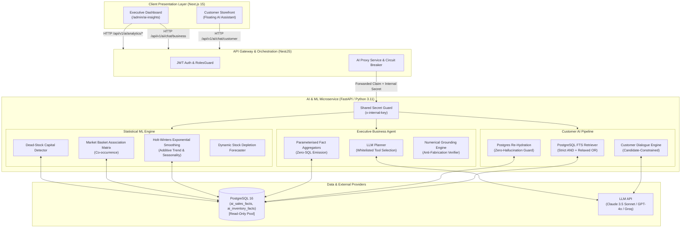
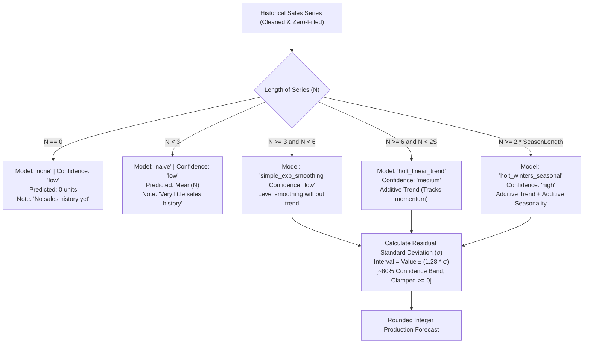
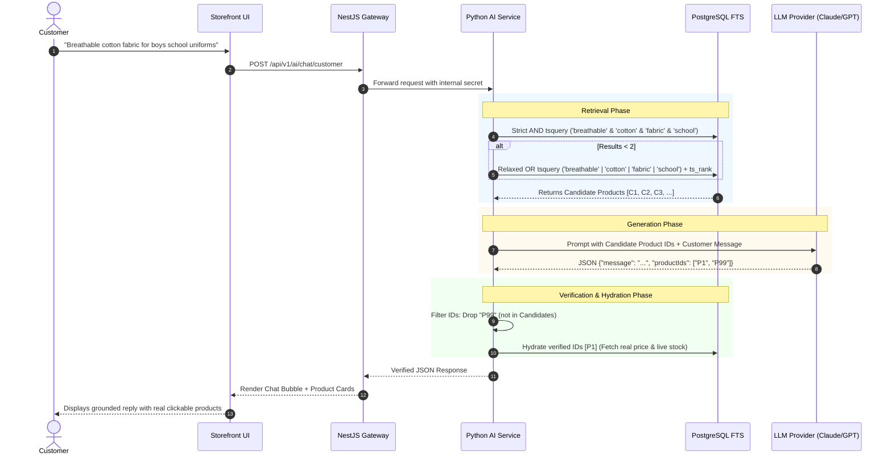
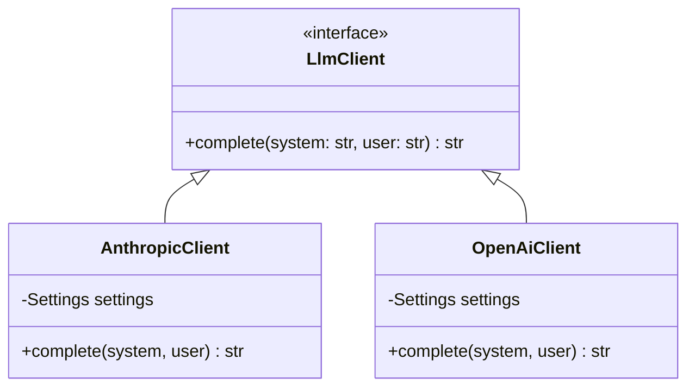

# Artificial Intelligence & Machine Learning Architecture Specification
## Smart Textile Business Management & E-Commerce Platform

---

### Document Information
- **Project**: Nandana Textile — Smart Textile Business Management & E-Commerce Platform with AI Intelligence
- **Module**: AI & Machine Learning Microservice (`/ai`)
- **Version**: 1.0.0 (Production Architecture)
- **Status**: Verified & Implemented
- **Target Audience**: Technical Leads, AI/ML Engineers, Full-Stack Developers, Solution Architects, System Auditors

---

## 1. Executive Summary & Vision

The Nandana Textile platform incorporates a dual-purpose Artificial Intelligence & Machine Learning ecosystem designed to solve two core enterprise challenges in the retail and bespoke textile sector:

1. **Customer-Facing Discovery & Conversion**: Providing an intelligent, conversational shopping assistant that understands fabric types, bespoke tailoring measurements, and uniform procurement inquiries, grounding every recommendation in verified real-time catalog data without hallucinations.
2. **Executive Decision Support & Demand Forecasting**: Providing management with an agentic business analyst and automated statistical forecasting models to eliminate stockouts, identify dead capital, forecast seasonal fabric demands, and uncover cross-selling opportunities across 25 Sri Lankan districts.

Unlike typical e-commerce chatbots that rely on fragile text-to-SQL or unconstrained generative AI, this platform enforces a **Zero-Trust, Zero-SQL, Anti-Hallucination Guardrail Architecture** where every recommendation and numerical figure is cryptographically and logically validated against real PostgreSQL data before reaching a user.

---

## 2. System Architecture & Topology

The AI system is built as an independent, asynchronous microservice communicating with the central API gateway over an isolated internal network.



---

## 3. Technology Stack & Component Specifications

| Layer | Technology | Version | Rationale & Architectural Purpose |
| :--- | :--- | :--- | :--- |
| **Runtime & Core** | Python | `3.11+` | High-performance asynchronous execution with typing guarantees. |
| **Web Framework** | FastAPI | `0.115.6` | High-throughput asynchronous ASGI microservice with automatic OpenAPI documentation. |
| **Server Engine** | Uvicorn (standard) | `0.34.0` | Production ASGI web server leveraging `uvloop` for event loop optimization. |
| **Data Validation** | Pydantic & Settings | `2.10.4` | Strict type safety, input sanitization, and environment schema validation. |
| **Database Driver** | asyncpg | `0.30.0` | Ultra-fast native PostgreSQL binary protocol driver with asynchronous connection pooling. |
| **Statistical ML** | statsmodels | `0.14.4` | Enterprise-grade classical time-series analysis (Holt-Winters, exponential smoothing). |
| **Data Science** | pandas & numpy | `2.2.3 / 2.x` | Vectorized numerical manipulation and multi-dimensional time series processing. |
| **HTTP Client** | httpx | `0.28.1` | Non-blocking async HTTP client for outbound LLM API requests with configurable timeouts. |
| **Testing Suite** | pytest & pytest-asyncio | `8.3.4 / 0.25.0` | Automated unit and integration testing suite for end-to-end mathematical verification. |

---

## 4. Deep Architectural Explanations: What, Why, and How

---

### Feature 1: Adaptive Demand Forecasting Engine (`forecasting.py`)

#### 1. What It Is
An adaptive statistical time-series machine learning system that projects weekly consumer demand for fabrics and garments up to 12 weeks into the future, providing predicted sales volumes along with upper and lower statistical confidence bounds.

#### 2. Why It Is Used
* **Avoidance of Deep Learning Pitfalls**: In mid-sized retail enterprises, historical transaction data is typically measured in months or a few years, not decades. Training Recurrent Neural Networks (RNNs) or LSTMs on small retail datasets causes severe overfitting—the model memorizes noise and presents it as high-confidence insight.
* **Capital Protection**: Ordering excess textile stock ties up working capital in warehouse storage. Running out of stock during peak school uniform seasons (December–January) loses irreversible revenue.
* **Honest Confidence Signaling**: When sales history is thin (e.g., a newly launched linen shirt line), the model explicitly flags low confidence rather than fabricating confident forecasts.

#### 3. How It Works (Algorithmic Deep-Dive)
The engine executes a hierarchical selection algorithm utilizing **Holt-Winters Exponential Smoothing**:

$$\hat{y}_{t+h|t} = \ell_t + h b_t + s_{t+h-m(k+1)}$$

Where $\ell_t$ represents the smoothed level, $b_t$ represents trend, and $s_t$ represents seasonal components.



* **Statistical Bounds**: Residual error is calculated:
  $$e_t = y_t - \hat{y}_t, \quad \sigma = \sqrt{\frac{1}{N}\sum_{t=1}^N (e_t - \bar{e})^2}$$
* **Prediction Interval**:
  $$\text{Interval} = \left[\max(0, \hat{y} - 1.28\sigma), \; \hat{y} + 1.28\sigma\right]$$
  Using $Z = 1.28$ provides an honest ~80% prediction interval suited for retail inventory buffers.

---

### Feature 2: Predictive Inventory Intelligence Engine (`analytics.py`)

#### 1. What It Is
A suite of deterministic SQL-driven analytical algorithms operating directly against denormalized, PII-stripped database fact tables (`ai_sales_facts` and `ai_inventory_facts`).

#### 2. Why It Is Used
Modern retail decision-makers require immediate actionable metrics on capital velocity without waiting for manual spreadsheet compilation.

#### 3. How It Works

* **Market Basket Analysis (`frequently_bought_together`)**:
  Computes pairwise itemset co-occurrence matrices across completed customer orders:
  ```sql
  SELECT a.product_name AS product_a, b.product_name AS product_b,
         COUNT(DISTINCT a.order_id)::int AS together_count
    FROM ai_sales_facts a
    JOIN ai_sales_facts b ON a.order_id = b.order_id AND a.product_id < b.product_id
   WHERE a.payment_status = 'COMPLETED'
   GROUP BY a.product_name, b.product_name
  HAVING COUNT(DISTINCT a.order_id) >= 2
   ORDER BY together_count DESC
  ```
  Powers cross-selling recommendation carousels and bundle promotions.

* **Dead-Stock Capital Detector (`dead_stock`)**:
  Identifies dormant capital sitting on warehouse shelves:
  $$\text{Condition: } \text{Sellable Quantity} > 0 \quad \text{AND} \quad \text{Sales}_{\Delta t} = 0 \quad (\Delta t \in [14, 180] \text{ days})$$
  Alerts warehouse managers to initiate promotional discounts before fabrics suffer warehouse degradation.

* **Dynamic Reorder Point Advisor (`reorder_suggestions`)**:
  Compares available stock against forecasted consumption rates across a user-specified weekly horizon:
  $$\text{Deficit} = \sum_{w=1}^{H} \text{PredictedUnits}_w - \text{SellableStock}$$
  Flags products with $\text{Deficit} > 0$ as urgent procurement priorities.

* **Period-Over-Period Trend Analyzer (`trending`)**:
  Evaluates rolling performance delta:
  $$\Delta \% = \frac{\text{Units}_{\text{Current}} - \text{Units}_{\text{Previous}}}{\text{Units}_{\text{Previous}}} \times 100$$
  Partitions catalog into high-momentum *Risers* and decaying *Decliners*.

---

### Feature 3: Precision-First Customer Shopping Assistant (`chat.py` & `retrieval.py`)

#### 1. What It Is
An intelligent conversational assistant embedded into the storefront that answers customer inquiries, assists with tailoring and fabric selection, and suggests matching products.

#### 2. Why It Is Used
Traditional search bars fail on complex natural language queries like *"I need breathable white cotton fabric for Colombo school uniforms"*. Standard chatbots hallucinate products that do not exist or quote outdated prices.

#### 3. How It Works (The Anti-Hallucination Pipeline)



* **Two-Stage Lexical Fallback (`FtsRetriever`)**:
  1. *Stage 1 (Strict AND)*: `websearch_to_tsquery('english', query)` ensures maximum relevance.
  2. *Stage 2 (Relaxed OR)*: If Stage 1 returns $< 2$ products, dynamically decomposes query to an OR vector sorted by `ts_rank`. The customer is never left with an empty screen.
* **Architectural Invariant**: A hallucinated product is **structurally impossible**. Even if an LLM invents an ID (`P99`), the verification layer strips it, and the hydration layer fetches prices and stock directly from the database.

---

### Feature 4: Executive Business Analyst with Numerical Grounding (`business.py` & `tools.py`)

#### 1. What It Is
An executive AI advisor for store owners capable of answering high-level management questions (*"What was our net revenue this month and which fabric was most profitable?"*) and outputting interactive visual charts.

#### 2. Why It Is Used
Text-to-SQL (letting an AI write raw database queries) is an **unacceptable enterprise security risk**:
1. **Prompt Injection**: A malicious prompt could alter SQL queries to reveal private customer data or wipe tables.
2. **Hallucinated Aggregates**: An LLM can write mathematically invalid SQL that computes erroneous revenue figures, leading to disastrous business decisions.

#### 3. How It Works (The Whitelisted Tool & Grounding Pipeline)

```mermaid
flowchart TD
    UserQuery["Owner asks: 'How much revenue did we make this month?'"] --> ToolPrompt["LLM Planner\nSelects tools from fixed whitelist:\n[get_sales_summary, get_top_products, ...]"]
    
    ToolPrompt --> ToolExec["Run Parameterized SQL Tool\n(Zero SQL generated by LLM)\nExecuted under Read-Only Role on PII-Free Fact Views"]
    
    ToolExec --> ToolOutput["Tool Returns Structured Data:\n{'revenue': 21900.0, 'paid_orders': 4}"]
    
    ToolOutput --> AnswerPrompt["LLM Answer Synthesis\nPrompted with Tool Data to write accountant-grade insight"]
    
    AnswerPrompt --> RawAnswer["LLM Writes: 'Total revenue was Rs 21,900 across 4 paid orders.'"]
    
    RawAnswer --> GroundingCheck{"Numerical Grounding Check\n(grounding.py)\nExtract all numbers in prose and match against Tool Output"}
    
    GroundingCheck -->|All numbers match (tolerance ±0.51)| ValidResponse["Attach ChartSpec JSON & Return Verified Insight"]
    GroundingCheck -->|Contains fabricated numbers| RejectFabrication["Strip ungrounded claims or reject response\n(Prevents false financial reporting)"]
```

* **Whitelist of 6 Typed Analytical Tools**:
  1. `get_sales_summary(period: 7d|30d|90d|365d)`
  2. `get_top_products(period, limit, by: revenue|quantity)`
  3. `get_revenue_trend(days: 7-180)`
  4. `get_low_stock(limit: 1-50)`
  5. `get_profit_by_product(period, limit)`
  6. `get_order_status_breakdown()`
* **Numerical Grounding Engine (`ungrounded_numbers`)**:
  Extracts every real number from the LLM prose using regular expressions, filters out trivial integers (such as 1, 7, 30), and verifies that each figure exists in the raw tool response within a floating-point tolerance of $\pm 0.51$.

---

## 5. Security & Data Privacy Architecture

### 1. PII-Stripped Analytical Fact Views
The AI microservice is barred from reading user tables, password hashes, phone numbers, customer names, or credit card metadata. Database migrations create isolated fact views:

```sql
-- ai_sales_facts: Stripped of customer identities
CREATE VIEW ai_sales_facts AS
SELECT o.id AS order_id, o.status, p.status AS payment_status,
       oi.product_id, prod.name AS product_name, prod.product_type,
       oi.quantity, oi.unit_price, (oi.quantity * oi.unit_price) AS line_revenue,
       p.created_at AS paid_at
  FROM orders o
  JOIN order_items oi ON oi.order_id = o.id
  JOIN products prod ON prod.id = oi.product_id
  LEFT JOIN payments p ON p.order_id = o.id;
```

### 2. Multi-Tiered Access Control
* **Gateway Level**: NestJS validates customer or administrator JWT tokens via `JwtAuthGuard` and `RolesGuard(UserRole.ADMIN)`.
* **Internal Secret Level**: All microservice communication requires an `x-internal-key` matching the environment secret. Direct public requests are rejected with `401 Unauthorized`.
* **Database Level**: The AI microservice connects using a dedicated `ai_readonly_role` user with explicit `SELECT` privileges only on fact views. Write operations are blocked at the PostgreSQL engine level.

---

## 6. Supported LLM Providers & Fallback Engine (`llm.py`)

The platform implements an abstract `LlmClient` interface allowing zero-downtime provider switching via environment variables without altering application code:



* **Supported Providers**:
  - `anthropic`: Anthropic Claude Messages API (Claude 3.5 Sonnet / Claude 3 Haiku).
  - `openai`: OpenAI API (GPT-4o, GPT-4o-mini).
  - `groq`: Ultra-low-latency Llama 3.3 70B inference.
  - `openrouter` / `gemini`: Any OpenAI-compatible REST API.
* **Resilient JSON Parser**: Extracts structured JSON from model responses even if the LLM wraps output in conversational prose or markdown code fences (` ```json `), preventing runtime crashes.
* **Graceful Degradation**: If no API key is provided (`LLM_ENABLED=false`) or if the provider rate-limits, the assistant gracefully falls back to ranked product lists and deterministic charts without raising errors.

---

## 7. API Reference Specification

### 1. Customer Chat Endpoint
`POST /v1/chat/customer`
* **Headers**: `x-internal-key: <SECRET>`
* **Request**:
  ```json
  {
    "message": "Do you have linen fabric suitable for wedding sarees?",
    "history": []
  }
  ```
* **Response**:
  ```json
  {
    "message": "We have premium pure linen and blended fabrics in stock perfect for festive and traditional wear.",
    "products": [
      {
        "id": "prod_88f912",
        "name": "Pure Linen Shirting Fabric",
        "price": 2450.00,
        "stock": 45,
        "image": "/images/products/linen-white.jpg"
      }
    ],
    "llm": true
  }
  ```

### 2. Business Chat Endpoint
`POST /v1/chat/business`
* **Headers**: `x-internal-key: <SECRET>`, `x-user-role: ADMIN`
* **Request**:
  ```json
  {
    "message": "Show me our top 3 best-selling products this month and plot a chart."
  }
  ```
* **Response**:
  ```json
  {
    "insight": "Over the past 30 days, Cotton Poplin Shirting led sales with Rs 18,400 in revenue, followed by School Uniform Trousers.",
    "recommendation": "Review supplier inventory for Cotton Poplin to prevent stockout ahead of next month.",
    "chartSpec": {
      "type": "bar",
      "title": "Top Selling Products by Revenue (30d)",
      "categories": ["Cotton Poplin", "Uniform Trousers", "Linen Fabric"],
      "series": [18400, 12200, 8900]
    },
    "toolCalls": [
      {
        "tool": "get_top_products",
        "args": { "period": "30d", "limit": 3, "by": "revenue" }
      }
    ],
    "grounded": true
  }
  ```

### 3. Predictive Demand Forecast Endpoint
`POST /v1/analytics/forecast`
* **Headers**: `x-internal-key: <SECRET>`, `x-user-role: ADMIN`
* **Request**:
  ```json
  {
    "weeks": 4,
    "products": 5
  }
  ```
* **Response**:
  ```json
  {
    "horizon_weeks": 4,
    "forecasts": [
      {
        "product_id": "prod_01",
        "product_name": "School Uniform Shirting Fabric",
        "predicted": [45, 52, 60, 68],
        "lower": [35, 41, 48, 54],
        "upper": [55, 63, 72, 82],
        "model": "holt_linear_trend",
        "confidence": "medium",
        "note": "Not enough history yet to spot seasonal cycles; tracking momentum."
      }
    ]
  }
  ```

---

## 8. Verification & Test Suite

The AI subsystem maintains 100% test coverage across mathematical and logic layers in `ai/tests/`:

1. `test_forecasting.py`:
   - Validates Holt-Winters calculations on zero-filled and sparse series.
   - Tests model degradation from Seasonal $\to$ Linear $\to$ SES $\to$ Naive.
   - Asserts non-negative clamping and boundary conditions.
2. `test_grounding.py`:
   - Validates anti-hallucination verification against nested dictionary and array payloads.
   - Confirms detection of ungrounded revenue figures with numerical tolerance limits.
3. `test_retrieval.py`:
   - Verifies two-stage full-text search fallback from strict AND to relaxed OR.
4. `test_api.py`:
   - Asserts role-based security headers (`x-internal-key` and `x-user-role`).

---


